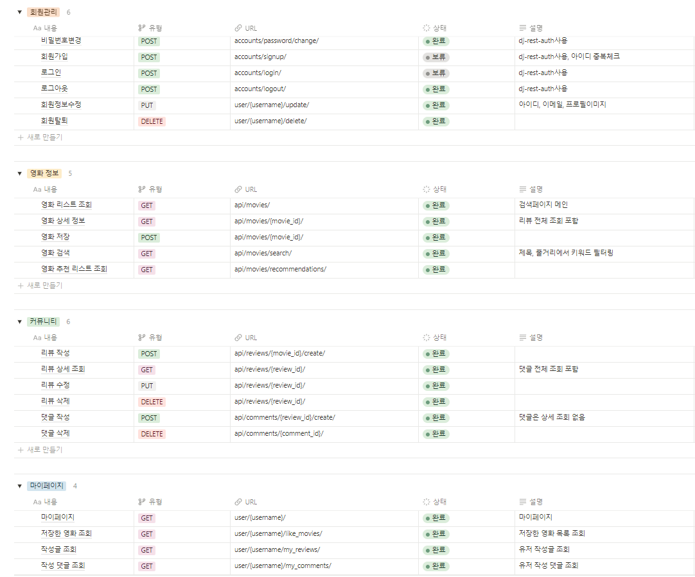

# Filminate
  
### 배경
---
.......

### 역할분담
---
- 정두홍: 백엔드
    - Django
    - mySQL
    - TMDB API로 데이터베이스 제작
    - 요청별 기능구현
    
- 김고은: 프론트엔드
    - Vue.js
    - Figma
    - 화면정의서 제작
    - 요청별 응답처리 기능구현
    - 기능별 웹페이지 구현

### 목표
---
.......

### 구현 정도
--- 
#### 회원
- 회원가입, 탈퇴, 로그인, 로그아웃, 비밀번호 변경 구현 완료
- 소셜 로그인 구현못함
- 프로필 페이지에서 사용자 정보 수정기능 구현 완료
- 프로필 페이지에서 좋아요한 영화 목록 및 작성한 리뷰, 댓글목록 확인기능 구현 완료

#### 영화 정보
- 전체 영화목록 및 검색 결과 목록 제공기능 구현 완료
- 추천 알고리즘 및 추천목록 제공기능 구현 완료
- 추천 알고리즘 이미지 유사도 정확성 목표보다 아쉬움

#### 커뮤니티
- 영화별 리뷰 작성 및 댓글 작성 기능 구현 완료

### 주요 기능
---
**추천 알고리즘**
- 포스터 이미지별 유사도를 기반으로 특정 영화와 비슷한 포스터를 가진 영화들을 추천목록으로 제공
- 사전학습된 CNN모델을 활용해 포스터들의 특징을 추출하고 각 결과들의 코사인 유사도를 계산해 각 영화와 높은 유사도 상위 5개의 영화를 연결해 데이터베이스에 M:N관계 구현
- 로그인한 사용자의 좋아요 영화 목록에서 랜덤으로 최대 3개의 영화 선택 및 좋아요 목록의 전체 장르들 기반으로 비슷한 장르의 영화들 중 최소 2개 선택해 총 5개의 영화를 기준으로 추천영화 목록을 제공

**영화 검색 기능**
- 기본적으로 전체 영화 목록 제공
- 사용자의 검색 키워드를 기준으로 영화 제목과 줄거리에서 해당 키워드로 필터링된 목록 제공

### 기능명세서
---

### ERD
---

### API 명세서
---

### 느낀점 / 후기
--- 
#### 정두홍
- 
#### 김고은